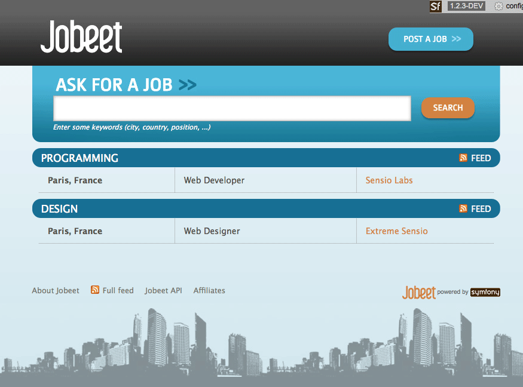
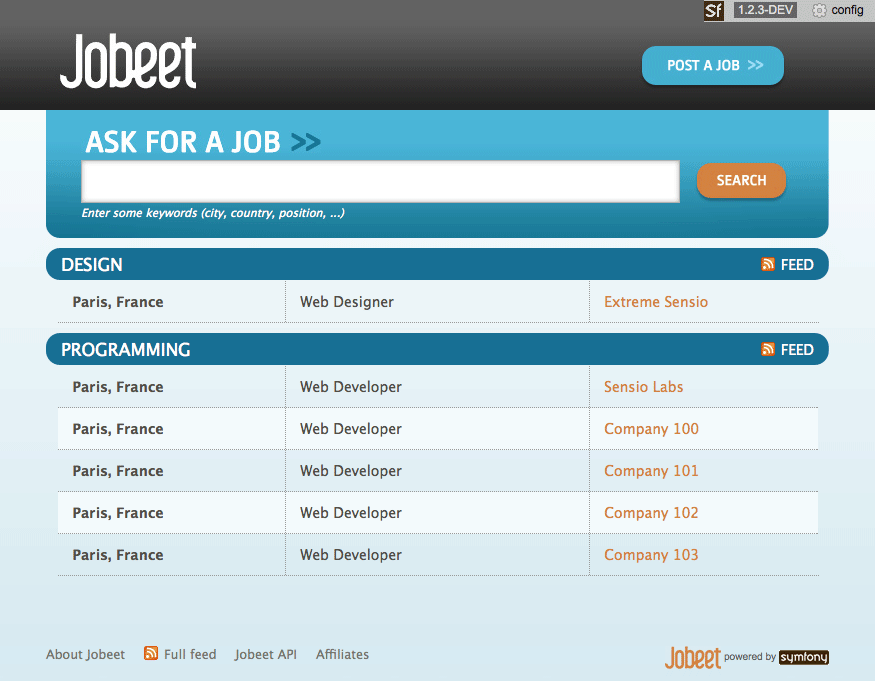

モデルの詳細

昨日はすばらしい日でした。プリティ URL の作り方とたくさんの事を自動で行う Ark フレームワークの使い方を学習しました。

今日は、あちらこちらのコードを調整して Jobeet の Web サイトを強化します。作業の中で、このチュートリアルの最初の 6 日の間に紹介したすべての機能を詳しく学びます。

DBIx::Class での 検索条件
-----------------------

2日目の必要要件を下記に示します:

"Jobeetサイトにユーザーが訪れたとき、利用可能な求人情報の一覧が見れる"

しかし現在のところ、利用可能かどうかは関係なく全ての求人情報が表示されます:

    sub index :Path {
        my ($self, $c) = @_;

        $c->stash->{jobs} = models('Schema::Job');
    }

アクティブな求人は30日前以内に投稿されたものです。
`models('Schema::Job');` は `Jobeet::Schema::Result::Job` の集合を表す ResultSet オブジェクトであることは先に学びました。ResultSet オブジェクトはなにも指定しないとすべての Job 一覧を表しますが、 search メソッドを使用することで条件を絞り込むことが出来ます。

利用可能な求人情報だけが選択されるように変更してみましょう:

    sub index :Path {
        my ($self, $c) = @_;

        $c->stash->{jobs} = models('Schema::Job')->search({
            created_at => { '>=', models('Schema')->now->add( days => -30 ) },
        });
    }

search メソッドの第一引数では検索条件をハッシュリファレンスで指定します。ここでは30日よりも古くない求人情報のみを選択するために基準を制限しました。search メソッドは検索条件で絞り込まれた ResultSet オブジェクトを返すので、そのまま stash に渡してあげれば今までのコードはなにも変更する必要はありません。

DBIx::Class で生成される SQL のデバッグ
------------------------------------

手書きで SQL を記述しないので、 DBIx::Class は異なるデータベース間の違いを管理して、3日目に選んだデータベースエンジンに最適化された SQL ステートメントを生成します。
しかし時に、 DBIx::Class が生成した SQL ステートメントを見ることは非常に役に立ちます。
たとえば、期待通りに動かない検索クエリをデバッグするときなどです。

DBIx::Class が生成する SQL のデバッグ方法は実はすでに学んでいます。 DBIC_TRACE 環境変数を使用するのでした。

    $ DBIC_TRACE=1 carton exec plackup dev.psgi

とすることで DBIx::Class が実行している SQL ステートメントをコンソール（STDERR）に表示させることが出来ます。

このような状態で /job/ にアクセスしてみてください。

    SELECT me.id, me.category_id, me.type, me.company, me.logo, me.url, me.position, me.location, me.description, me.how_to_apply, me.token, me.is_public, me.is_activated, me.email, me.expires_at, me.created_at, me.updated_at FROM jobeet_job me WHERE ( created_at >= ? ): '2016-02-14T12:00:00'

このような表示がされましたか？ さきほどの 30 日以内と言う条件がただしく入っているのがわかります。

もし STDERR ではなくファイルにも出力したいと言う場合は

    $ DBIC_TRACE=1=/path/to/file.log ...

のような形で環境変数を設定してやればそのファイルに SQL ログがはき出されます。

オブジェクトのシリアライズ
----------------------

上記のコードが動作するとしても、2 日目からの要件が考慮されていないので完璧とはほど遠い状態です:

"ユーザーは求人広告の有効期間を 30 日延長するために戻ることができる"

しかし上記のコードは `created_at` の値に依存するのと、このカラムは作成時の日付を保存するので上記の要件を満たすことができません。

しかし 3 日目に記述したデータベーススキーマを覚えているのであれば、`expires_at` カラムも定義しました。デフォルトデータが設定されていないので現在このデータの値は常に空です。

しかし job が作成されるとき、これを現在の日付の後の 30 日に自動的に設定できます。この方法はすでに学習しましたね。すでに `created_date` などが自動的に入るようなコードを書いています。Result クラスの insert メソッドを上書きすれば良かったのでしたね。

今回は Job テーブルだけへの適用なので Jobeet::Schema::Result::Job に以下のメソッドを追加しましょう。 まず、クラスの冒頭に`use Jobeet::Models;` を追加しましょう｡

    sub insert {
        my $self = shift;

        $self->expires_at( models('Schema')->now->add( days => 30 ) );
        $self->next::method(@_);
    }

これで Job 新規登録時に `expires_at` が 30日後に自動的にセットされます。
最後に `$self->next::method(@_);` としているのは他の場所で insert をフックしている場合にそちらのメソッドにも処理を投げると言う意味です。こうしておくことで ResultBase で定義した insert メソッドにも処理が回ります。

では、Job コントローラでの検索条件の指定も `expires_at` を使用するように変更してみましょう。

    sub index :Path {
        my ($self, $c) = @_;

        $c->stash->{jobs} = models('Schema::Job')->search({
            expires_at => { '>=', models('Schema')->now },
        });
    }

将来、`expires_at` の日付で選択した仕事のみを対象とするためにクエリを制限します。

デフォルトデータの追加
-------------------

/job/ ページをブラウザーでリフレッシュしても数日前に投稿されたデータベース内の求人内容は変更されません。以下のスクリプトですでに期限切れした求人情報を追加してみましょう:

    use strict;
    use warnings;
    use FindBin::libs;

    use Jobeet::Models;
    use DateTime;

    my $job_rs = models('Schema::Job');
    my $cat_rs = models('Schema::Category');

    my $cat_programming = $cat_rs->find({ name => 'Programming' });
    my $job = $job_rs->create({
        category_id  => $cat_programming->id,
        company      => 'Sensio Labs',
        position     => 'Web Developer',
        location     => 'Paris, France',
        description  => 'Lorem ipsum dolor sit amet, consectetur adipisicing elit.',
        how_to_apply => 'Send your resume to lorem.ipsum [at] dolor.sit',
        is_public    => 1,
        is_activated => 1,
        token        => 'job_expired',
        email        => 'job@example.com',
    });
    $job->update({
        created_at => '2005-12-01',
        expires_at => '2005-12-31',
    });

このスクリプトを実行すると新たに期限切れした求人情報がデータベースに投入されます。
今後、デフォルトデータをセットし直したくなったときのためにこのスクリプトの中身を `script/insert_default_data.pl` にも追加しておきましょう。

カスタムコンフィギュレーション
-------------------------

`Jobeet::Schema::Result::Job` の insert メソッドにおいて、期限切れしている求人に関して日数を決め打ちしました。 30 日を設定可能にするほうがよいです。 Ark フレームワークはアプリケーション固有の設定用に組み込みの設定ファイル、config.pl ファイルを提供します。この使い方はすでに学びましたね。

設定ファイルを以下のように変更してみましょう。

    my $home = Jobeet::Models->get('home');

    return {
        default_view    => 'MT',
        active_days     => 30,

        database => [
            'dbi:SQLite:' . $home->file('database.db'), '', '',
             {
                 sqlite_unicode => 1,
             },
        ],
    };

`active_days => 30,` と言う行を追加しました。

そして insert メソッドを以下のように修正します：

    sub insert {
        my $self = shift;

        $self->expires_at( models('Schema')->now->add( days => models('conf')->{active_days} ) );
        $self->next::method(@_);
    }

リファクタリング
-------------

書いたコードが動作してはいますが、まだ完全に正しいものではありません。問題はどこにあるのでしょうか？

コントローラで検索条件を指定しているコードはアクションに所属せず、Modelレイヤーに所属します。
昨日述べたように MVC モデルにおいて、モデルはすべてのビジネスロジックを定義し、コントローラはモデルやビューへの配送業者の役割しか行いません。
専用のモデルクラスを用意しても良いですが、 DBIx::Class の Result、ResultSet クラスには任意のメソッドを追加でき、汎用的なモデルクラスとしても使用できます。 Jobeet::Schema::ResultSet::Job クラスを作成し以下のように定義しましょう。

    package Jobeet::Schema::ResultSet::Job;
    use strict;
    use warnings;
    use utf8;
    use parent 'DBIx::Class::ResultSet';

    use Jobeet::Models;

    sub get_active_jobs {
        my $self = shift;

        $self = $self->search({ expires_at => { '>=', models('Schema')->now->strftime("%F %T") }, });

        $self;
    }

    1;

`Jobeet::Schema` で `load_namespaces` メソッドを呼ぶと `Jobeet::Schema::Result::*` と `Jobeet::Schema::ResultSet::*` ネームスペースのクラスを自動的に読むと言いました。つまりこの Jobeet::Schema::ResultSet::Job は `Result::Job` クラスの ResultSet として自動的にロードされます。

Job コントローラからはこのモデルを使用するようにしてみましょう。

    sub index :Path {
        my ($self, $c) = @_;

        $c->stash->{jobs} = models('Schema::Job')->get_active_jobs;
    }

このリファクタリングには以前のコードよりいくつかの利点があります。

 * 利用可能な仕事を取得するロジックは Model にある
 * Controller のコードはより読みやすくなる
 * get_active_jobs メソッドは再利用できる (たとえば別のアクションで使う、たとえばCLIスクリプトから使う)
 * Model コードでユニットテストができる

`expires_at` カラムで求人をソートしてみましょう。

    sub get_active_jobs {
        my $self = shift;

        $self = $self->search({ expires_at => { '>=', models('Schema')->now->strftime("%F %T") }, });
        $self = $self->search({}, { order_by => { -desc => 'expires_at'} });

        $self;
    }

ResultSet クラスの search メソッドの第一引数では検索条件 (WHERE CLAUSE) を指定するといいました、第二引数では検索の属性（LIMITやORDER BYなど）を指定します。また一度の search ですべてを指定することも出来ますし、上記の例のように search を何度も読んで条件を複数の場所に分けて絞り込んでいくことも可能です。絞り込んでいく場合は、メソッドチェーンのようにつなげて絞り込むことも可能です。

ホームページでのカテゴリ表示
------------------------

2日目の必要要件を下記に示します:

"求人はカテゴリでまずソートされ、その次に投稿日時でソートされる(新しいものが最初に)"

これまで、求人のカテゴリについては考慮していませんでした。必要要件からはホームページでカテゴリに基づいて表示しなければなりません。まず最初に少なくとも1つの利用可能な求人から全てのカテゴリを取得することが必要です。

`Jobeet::Schema::ResultSet::Category` を作成し以下のように get_with_jobs メソッドを作成しましょう。

    package Jobeet::Schema::ResultSet::Category;
    use strict;
    use warnings;
    use parent 'DBIx::Class::ResultSet';

    use Jobeet::Models;

    sub get_with_jobs {
        my $self = shift;

        $self->search(
            { 'jobs.expires_at' => { '>=', models('Schema')->now->strftime("%F %T") } },
            { join => 'jobs', group_by => 'me.name' },
        );
    }

    1;

search の第二引数では join するリレーション名を指定できます。
Schema 定義でリレーション定義をした名前を指定するだけで DBIx::Class はただしく JOIN 演算子を使用してくれます。

Jobコントローラを以下のように、カテゴリをテンプレートに渡すよう変更しましょう：

    sub index :Path {
        my ($self, $c) = @_;

        $c->stash->{categories} = models('Schema::Category')->get_with_jobs;
    }

テンプレートでは、全てのカテゴリを渡すように反復し、利用可能な求人を表示する必要があります:

    ? extends 'common/base';

    ? block stylesheets => sub {
    <link rel="stylesheet" type="text/css" href="<?= $c->uri_for('/css/main.css') ?>" />
    <link rel="stylesheet" type="text/css" href="<?= $c->uri_for('/css/jobs.css') ?>" />
    ? }

    ? block content => sub {
    

    ? for my $category ($c->stash->{categories}->all) {
        
name ?>">
          

            

              <a href="">Feed</a>
            

            <h1><?= $category->name ?></h1>
          

          <table class="jobs">
    ? my $i = 0;
    ? for my $job ($category->get_active_jobs) {
              <tr class="<?= $i++ % 2 ? 'even' : 'odd' ?>">
                <td class="location">
                  <?= $job->location ?>
                </td>
                <td class="position">
                  <?= $job->position ?>
                </td>
                <td class="company">
                  <?= $job->company ?>
                </td>
              </tr>
    ? } #endfor $job
          </table>
        

    ? } #endfor $category
    

    ? } #endblock content

これを動かすには、カテゴリResultオブジェクト(Jobeet::Schema::Result::Category)にアクティブな求人を返す get_active_jobs メソッドを追加する必要があります:

    sub get_active_jobs {
        my $self = shift;

        $self->jobs(
            { expires_at => { '>=', models('Schema')->now } },
            { order_by => { -desc => 'created_at' } }
        );
    }

今後はこのカテゴリからの `get_active_jobs` メソッドを使用するので混乱しないよう ResultSet::Job からはメソッドを削除しておきましょう。

結果の制限
--------

ホームページの仕事リストの中に実装すべき1つの要件がまだあります:

"各カテゴリごとに最新の10件を表示し、得られたカテゴリに関する全ての求人リストへのリンクを表示する"

これらは単に get_active_jobs メソッドに追加するだけで十分です:

    sub get_active_jobs {
        my $self = shift;
        my $attr = shift || {};

        $attr->{rows} ||= 10;

        $self->jobs(
            { expires_at => { '>=', models('Schema')->now->strftime("%F %T") } },
            {   order_by => { -desc => 'created_at' },
                rows     => $attr->{rows},
            }
        );
    }

適切なLIMIT句はModelの中で決め打ちされていますが、この値を設定可能にすることはよいことです。 config.pl にセットした求人の最大件数をテンプレートに渡すように変更します:

          <table class="jobs">
    ? my $i = 0;
    ? my $max_rows = $c->config->{max_jobs_on_homepage};
    ? for my $job ($category->get_active_jobs({ rows => $max_rows })) {

加えて、config.pl に新しい設定を追加します。:

    active_days => 30,
    max_jobs_on_homepage => 10,

ダミーデータ
----------

`max_jobs_on_homepage` に 1 より低い値がセットされなければ、違いはわからないでしょう。
スクリプトを使ってたくさんの求人を追加することが必要です。以下のようなスクリプトでダミーデータを作成してみましょう。

    use strict;
    use warnings;
    use FindBin::libs;

    use Jobeet::Models;

    my $job_rs = models('Schema::Job');
    my $cat_rs = models('Schema::Category');

    my $cat_programming = $cat_rs->find({ name => 'Programming' });

    for my $i (100 .. 130) {
        my $job = $job_rs->create({
            category_id  => $cat_programming->id,
            company      => "Company $i",
            position     => 'Web Developer',
            location     => 'Paris, France',
            description  => 'Lorem ipsum dolor sit amet, consectetur adipisicing elit.',
            how_to_apply => "Send your resume to lorem.ipsum [at] company_${i}.sit",
            is_public    => 1,
            is_activated => 1,
            token        => "job_$i",
            email        => 'job@example.com',
        });
    }

さきほどと同様にデータベースを初期化したときのためにこの内容を `script/insert_default_data.pl` に追加しておきましょう。

スクリプトを走らせた後、リロードしてホームページでProgrammingカテゴリに関して10件の求人だけが表示されるか見ます。次のスクリーンショットにおいて、画像を小さくするために求人の最大数を5件に変更しました:

カテゴリページへのリンク
--------------------

今度はホームページにカテゴリページへのリンクを追加してカテゴリページを作りましょう。

しかし、少しお待ちください。予定時間はまだ過ぎていないのであまり作業をしてきませんでした。あなたには十分な時間と自分自身でこれをすべて実装するための知識があります！練習してみましょう。明日我々の実装を確認します。

また明日
------

ローカルな Jobeet プロジェクトで実装に取り組んでください。

我々の実装と共に明日またお会いしましょう。

Good luck!
