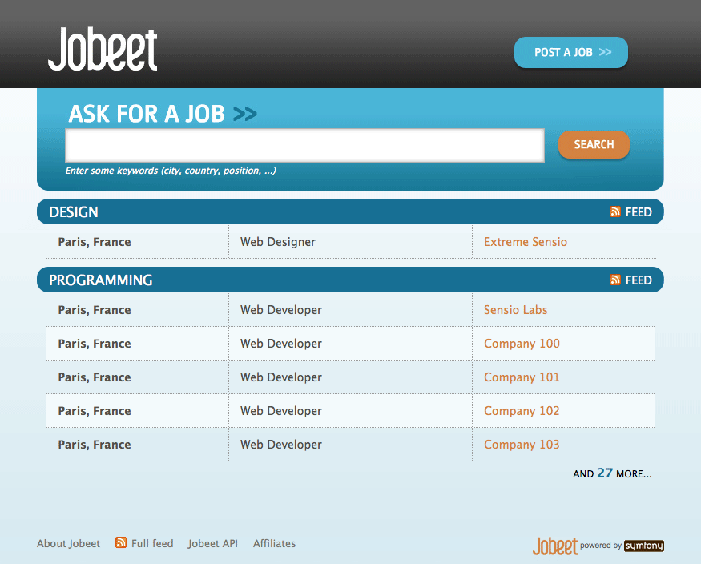
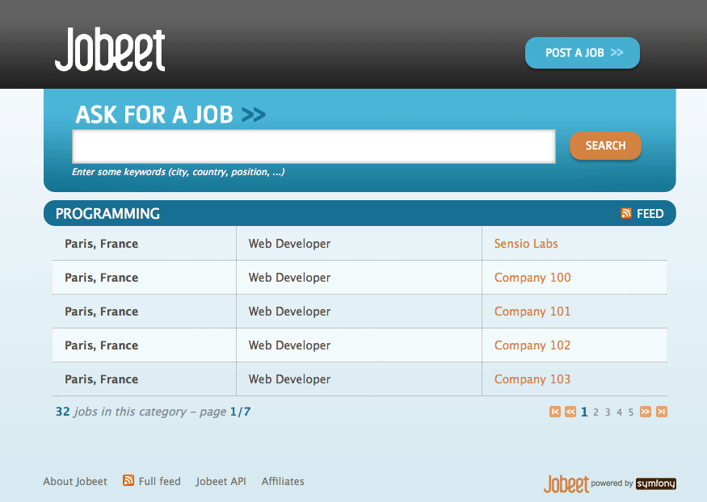

カテゴリページで遊ぶ

昨日はたくさんの異なる領域: DBIx::Classでクエリを行う、ルーティング、デバッグとカスタムの設定など Ark の知識を広げました。今日は少しチャレンジして終わります。

あなたが Jobeet のカテゴリページで取り組んでくださることを期待しています。今日のチュートリアルはさらに大切になります。

準備はいいですか？ 実現可能な実装について語りましょう。

依存モジュール
------------

今回のストーリーで以下のまた新しいモジュールを使用します。

 * String::CamelCase
 * Data::Page::Navigation

CPAN 経由でインストールしておいてください。

カテゴリのルート
---------------

それでは本日の内容に入りましょう。

まず、カテゴリ用のコントローラを作成しましょう。

    /category/{category_name}

という URL を扱うことを考えてください。`Jobeet::Controller::Category` を以下のように作成します。

    package Jobeet::Controller::Category;
    use Ark 'Controller';

    sub show :Path :Args(1) {
        my ($self, $c, $category_name) = @_;

    }

    1;

slug カラムの追加
---------------

カテゴリ名を URL で表すための slug カラムを Category テーブルに追加しましょう。以下のカラムを Jobeet::Schema::Result::Category に追加します。

        slug => {
            data_type   => 'VARCHAR',
            size        => 255,
            is_nullable => 1,
        },

またインデックスも追加しておきましょう。

    __PACKAGE__->add_unique_constraint(['slug']);

カラムを更新したので新しい DDL ファイルを作成しましょう。

    $ carton exec perl ./script/dev/create_ddl.pl

そしてここでデータベースもアップグレードと行きたいところですが、以下のコマンドを実行すると

    $ carton exec perl ./script/dev/migrate.pl
    ...
    BEGIN;

    ALTER TABLE jobeet_category ADD COLUMN slug VARCHAR(255);

    CREATE UNIQUE INDEX jobeet_category_slug ON jobeet_category (slug);

    COMMIT;

slug カラムを Category テーブルが更新される度に自動的に更新されるようにしましょう。
Jobeet::Schema::Result::Category にさらに次のメソッドを追加します。

    sub insert {
        my $self = shift;

        $self->slug( decamelize $self->name );

        $self->next::method(@_);
    }

    sub update {
        my $self = shift;

        if ($self->is_column_changed('name')) {
            $self->slug( decamelize $self->name );
        }

        $self->next::method(@_);
    }

INSERT 時には常に name から slug を作成し、UPDATE 時には name が更新されていた場合のみ slug を更新するようにしています。

またこの中で使用している decamelize 関数は String::CamelCase モジュールによるものです。
クラスの冒頭部に

    use String::CamelCase qw(decamelize);

と追加しておきましょう。
そして以下の手順でデータベースを更新しましょう。

    $ rm database.db
    $ carton exec perl ./script/dev/migrate.pl
    $ carton exec perl ./script/dev/insert_default_data.pl

これで slug つきのデフォルトデータが作成されました。

カテゴリのリンク
--------------

リンクをカテゴリページに追加するために job モジュールの index.mt テンプレートを編集します:

    <!-- some HTML code -->

            <h1>
              <a href="<?= $c->uri_for('/category', $category->slug) ?>">
                <?= $category->name ?>
              </a>
            </h1>

    <!-- some HTML code -->

          </table>

    ? my $count = $category->get_active_jobs->count;
    ? if ( (my $rest = $count - $max_rows) > 0 ) {
          

            and <a href="<?= $c->uri_for('/category', $category->slug) ?>"><?= $rest ?></a>
            more...
          

    ? } # endif

        

    <!-- some HTML code -->

現在のカテゴリで表示する求人件数が10を越える場合のみにリンクを表示します。リンクは表示されない求人件数を含みます。
このテンプレートを動作させるために、`Jobeet::Schema::Result::Category` の `get_active_jobs` メソッドを修正する必要があります。昨日までのコードでは rows を指定しないと 10 に決め打ちするようになっていました。この場合すべての jobs を取得するコードを書くことができません。
以下のように修正しましょう。

    sub get_active_jobs {
        my $self = shift;
        my $attr = shift || {};

        $self->jobs(
            { expires_at => { '>=', models('Schema')->now->strftime("%F %T") } },
            {   order_by => { -desc => 'created_at' },
                defined $attr->{rows} ? (rows => $attr->{rows}) : (),
            }
        );
    }

/job/ を開くと以下のようにリンクが正しくついています。次のスクリーンショットでは短くするために5件の求人を表示しており、10件を見ることになります(max_jobs_on_homepage設定):

コントローラの実装
---------------

さきほど作った Category コントローラ（Jobeet::Controller::Category）の実装を加えていきましょう。
モデルを使用するため、冒頭部に

    use Jobeet::Models;

を追加します。そして、URL で受け取った slug でカテゴリを検索し、見つからなかった場合 404 ページを表示しましょう。

        my $category = models('Schema::Category')->find({ slug => $category_name })
            or $c->detach('/default');

カテゴリが見つかった場合はそれをテンプレートに渡します。

        $c->stash->{category} = $category;

ファイルの全体はこのようになります：

    package Jobeet::Controller::Category;
    use Ark 'Controller';

    use Jobeet::Models;

    sub show :Path :Args(1) {
        my ($self, $c, $category_name) = @_;

        my $category = models('Schema::Category')->find({ slug => $category_name })
            or $c->detach('/default');

        $c->stash->{category} = $category;
    }

    1;

カテゴリテンプレート
-----------------

つぎにテンプレートを設置しましょう。 root/category/show.mt として以下のようなテンプレートを作成しましょう。

    ? my $category = $c->stash->{category};

    ? extends 'common/base';

    ? block stylesheets => sub {
    <link rel="stylesheet" type="text/css" href="<?= $c->uri_for('/css/main.css') ?>" />
    <link rel="stylesheet" type="text/css" href="<?= $c->uri_for('/css/jobs.css') ?>" />
    ? }

    ? block title => sub { sprintf 'Jobs in the %s category', $category->name };

    ? block content => sub {
    

      

        <a href="">Feed</a>
      

      <h1><?= $category->name ?></h1>
    

    <table class="jobs">
    ? my $i = 0;
    ? for my $job ($category->get_active_jobs) {
        <tr class="<?= $i++ % 2 ? 'evel' : 'odd' ?>">
          <td class="location">
            <?= $job->location ?>
          </td>
          <td class="position">
            <?= $job->position ?>
          </td>
          <td class="company">
            <?= $job->company ?>
          </td>
        </tr>
    ? } # endfor $job
    </table>

    ? } # endblock content

サブ階層のベーステンプレート
-----------------------

job の index.mt テンプレートから求人リストを作成する `<table>` タグをコピー＆ペーストしたことに注目してください。
これはよいことではありません。
新しいトリックを学びましょう。

job/index.mt、category/show.mt はどちらも jobs.css を参照しています、この部分を共通化した jobs 用のベーステンプレートを作りましょう。root/common/jobs_base.mt という名前で以下のようにベーステンプレートを作ります：

    ? extends 'common/base';

    ? block stylesheets => sub {
    <link rel="stylesheet" type="text/css" href="<?= $c->uri_for('/css/main.css') ?>" />
    <link rel="stylesheet" type="text/css" href="<?= $c->uri_for('/css/jobs.css') ?>" />
    ? }

そして、job/index.mt や category/show.mt はこの jobs_base.mt を継承すればスタイルシート宣言は省略することができます。これはプログラムコードと同じ考え方ですね。

    ? extends 'common/jobs_base';

また category/show.mt で title ブロックを定義していますがベーステンプレートにそのブロックが無いので common/base.mt のタイトル部分を

        <title><? block title => sub { 'Jobeet - Your best job board' } ?></title>

と変更します。このようにブロックを細かく定義することがテンプレート継承をうまくつかうコツです。

パーシャルテンプレート
-------------------

content ブロックの table の中身も二つのテンプレートで同じものが含まれていることに気がつくでしょう。
テンプレートの一部を再利用する必要があるとき、パーシャルテンプレートを作る必要があります。パーシャルは複数のテンプレートの間で共有できるテンプレートのスニペットです。

root/job/_partial_jobs.mt として以下のようなテンプレートを作りましょう：

    ? my @jobs = @_;
    <table class="jobs">
    ? my $i = 0;
    ? for my $job (@jobs) {
        <tr class="<?= $i++ % 2 ? 'even' : 'odd' ?>">
          <td class="location">
            <?= $job->location ?>
          </td>
          <td class="position">
            <?= $job->position ?>
          </td>
          <td class="company">
            <?= $job->company ?>
          </td>
        </tr>
    ? } #endfor $job
    </table>

そして `include` ヘルパーを利用することでパーシャルテンプレートをインクルードできます：

    <?= include('job/_partial_jobs', @jobs) ?>

第二引数目以降はテンプレートに渡す引数そのままになります。

両方からのHTMLコードの `<table>` を `include` の呼び出しで置き換えます:

root/job/index.mt:

    ?= include('job/_partial_jobs', $category->get_active_jobs({ rows => $max_rows }));

root/category/show.mt:

    ?= include('job/_partial_jobs', $category->get_active_jobs);

リストのパジネーション
------------------

2日目の要件より:

"リストはページごとに20件の求人でページ分割される"

DBIx::Class でページオブジェクトを扱うには、`search` メソッドの属性として rows とともに page 属性を与えてあげるだけです。

コントローラ(Jobeet::Controller::Category)から jobs として ResultSet オブジェクトをテンプレートに渡すようにして見ましょう：

        $c->stash->{jobs} = $category->get_active_jobs({
            rows => models('conf')->{max_jobs_on_category},
            page => $c->req->parameters->{page} || 1,
        });

また Jobeet::Schema::Result::Category に page 属性をハンドリングできるよう修正しましょう：

    sub get_active_jobs {
        my $self = shift;
        my $attr = shift || {};

        $self->jobs(
            { expires_at => { '>=', models('Schema')->now->strftime("%F %T") } },
            {   order_by => { -desc => 'created_at' },
                defined $attr->{rows} ? (rows => $attr->{rows}) : (),
                defined $attr->{page} ? (page => $attr->{page}) : (),
            }
        );
    }

`max_jobs_on_category` という設定でカテゴリページに表示するジョブ数を得ているので、config.pl にその設定を付け足しましょう。

        active_days => 30,
        max_jobs_on_homepage => 10,
        max_jobs_on_category => 20,

rows と page 属性を与えられた ResultSet オブジェクトは pager メソッドでページャオブジェクトを返してくれます。それを使用すれば簡単にパジネーションを実装できます。

ここで得られるページャオブジェクトは `Date::Page` というクラスのオブジェクトですが、デフォルトでは今回の要件にはシンプルすぎるため、拡張します。Data::Page::Navigation というパッケージを use することで、Data::Page クラスを自動的に拡張する必要があります。

アプリケーションクラス (Jobeet.pm) に

    use Data::Page::Navigation;

という行を加えてください。これでこのアプリケーション中の Data::Page クラスはこのモジュールによって拡張されます。

最後にテンプレート(category/show.mt)を更新しましょう：

    ? my $category = $c->stash->{category};
    ? my $jobs     = $c->stash->{jobs};
    ? my $pager    = $jobs->pager;

    ? extends 'common/jobs_base';

    ? block title => sub { sprintf 'Jobs in the %s category', $category->name };

    ? block content => sub {
    

      

        <a href="">Feed</a>
      

      <h1><?= $category->name ?></h1>
    

    ?= include('job/_partial_jobs', $jobs->all);

    ? if ($pager->last_page > 1) {
      

        <a href="<?= $c->req->uri_with({ page => $pager->first_page }) ?>">
          
        </a>

    ? if ($pager->previous_page) {
        <a href="<?= $c->req->uri_with({ page => $pager->previous_page }) ?>">
          
        </a>
    ? } else {
          
    ? }

    ? for my $p ($pager->pages_in_navigation) {
    ?     if ($p == $pager->current_page) {
              <?= $p ?>
    ?     } else {
              <a href="<?= $c->req->uri_with({ page => $p }) ?>"><?= $p ?></a>
    ?     }
    ? }

    ? if ($pager->next_page) {
        <a href="<?= $c->req->uri_with({ page => $pager->next_page }) ?>">
          
        </a>
    ? } else {
          
    ? }

        <a href="<?= $c->req->uri_with({ page => $pager->last_page }) ?>">
          
        </a>
      

    ? } # endif

    

      <strong><?= $pager->total_entries ?></strong> jobs in this category

    ? if ($pager->last_page > 1) {
        - page <strong><?= $pager->current_page ?>/<?= $pager->last_page ?></strong>
    ? }
    

    ? } # endblock content

たいていのコードでは他のページへのリンクが扱われます。このテンプレートで使われるページャメソッドのリストは次のとおりです:

    * first_page: 最初のページを返す
    * last_page: 最後のページを返す
    * current_page: 現在のページを返す
    * total_entries: 結果の合計数を返す
    * pages_in_navigation($num): 現在のページを中心とした $num で指定されたページ数分のページリストを返す。($num はデフォルト 10)
    * previous_page: 前のページを返す
    * next_page: 次のページを返す

また、`$c->req->uri_with` で現在のページの特定のクエリのみを置き換えた URL をつくることができ、パジネーションを作成するときに使用すると便利です。

また明日
-------

昨日独自の実装に取り組んだのであれば今日はあまり学ばなかったと感じるでしょう。
これは Ark の哲学に慣れつつあることを意味します。
Ark の Web サイトに新しい機能を追加するプロセスは常に同じです: URLを考え、アクションを作り、モデルを更新し、テンプレートを書きます。そして、よい開発習慣を複数の事例に適用できるのであれば、早く Ark マスターになれます。

明日はJobeetの新しい週の始まりです。祝うために、真新しいトピック: フォームを語ります。
