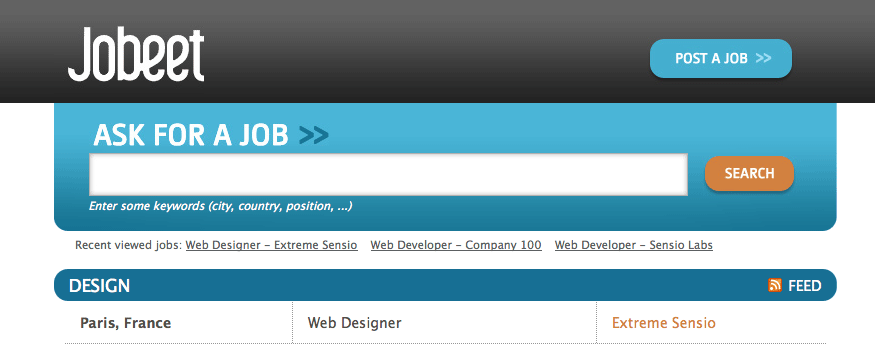

セッション

今日は、HTTP リクエストの間の永続データを管理する方法を理解します。
ご存じのとおり、HTTP プロトコルはステートレスです。
それぞれのリクエストはその前後のリクエストから独立していることを意味します。
現代の Web サイトはユーザーエクスペリエンスを強化するためにリクエストの間のデータを一貫させる方法が必要です。

セッションはそのような複数の HTTP リクエスト間でのデータの共有を可能にする技術です。
セッションにはセッションデータを保存するためのバックエンドエンジンと、セッションIDを保存するためのステートエンジンにわかれていて、 Ark では複数のエンジンから任意の組み合わせのセッションを使うことができます。

ステートエンジンとしては現在

 * Cookie
 * URL

をサポートしています。 これはほとんどのアプリケーションが Cookie を使用します。URL クエリによるセッションIDの引き渡しは主にモバイルアプリケーション用です。

バックエンドエンジンは CPAN 上に入手可能なすべてのキーバリューストアのモジュールに対応します。
`Cache::Cache` インタフェースをもっているモジュールはそのままバックエンドとして使用できます。そうでなくても簡単なラッパーをかけばOKです。

今回はステート保存には Cookie を、バックエンドはファイルにセッション情報を保存する Cache::FastMmap を使用してみましょう。

依存モジュール
---------------

バックエンドに使用する Cache::FastMmap を`cpanfile`に追加してインストールしておきましょう。

    requires 'Cache::FastMmap';

    $ carton install

バックエンドモジュールをモデルとして登録
----------------------------------

`Cache::FastMmap` はキーバリュー形式でデータを保存できるライブラリです。
これをまずは Ark モデルとして使用できるように登録しましょう、`Jobeet::Models` に以下の行を追加します。

    use Cache::FastMmap;

    ...

    register cache => sub {
        my $self = shift;

        my $conf = $self->get('conf')->{cache}
            or die 'require cache config';

        $self->ensure_class_loaded('Cache::FastMmap');
        Cache::FastMmap->new(%$conf);
    };

cache という名前で Cache::FileCache オブジェクトを登録しています。
また、config.pl の cache というキーを設定として参照するようにしてあります。 config.pl にも以下の設定を加えましょう。

        cache => {
            share_file     => $home->file('tmp', 'cache')->stringify,
            unlink_on_exit => 0,
        },

アプリケーションホームディレクトリ以下の `tmp/cache` というファイルにデータを保存するということになります。

設定がうまくいっているかどうかをテストしておきましょう。テストの書き方は覚えましたよね？
t/models/cache.t という名前で以下のように簡単なテストを書いておきましょう：

    use strict;
    use warnings;
    use Test::More;

    use Jobeet::Test;
    use Jobeet::Models;

    my $cache = models('cache');

    ok $cache, 'cache model return ok';
    isa_ok $cache, 'Cache::FastMmap';

    my $test_key = '____test_key____';

    ok !$cache->get($test_key), 'cache is not set yet';

    $cache->set($test_key => 'Hello');

    is $cache->get($test_key), 'Hello', 'cache set ok';

    $cache->remove($test_key);

    ok !$cache->get($test_key), 'cache remove ok';

    done_testing;

モデル取得のテストとデータの更新、取得、削除を行っています。

セッションプラグインの設定
----------------------

Ark ではセッション機能はプラグインをして提供されます。プラグインの読み込みはアプリケーションクラスで指定します。Jobeet.pm を開き以下のように設定します：

    use_plugins qw{
        Session
        Session::State::Cookie
        Session::Store::Model
    };

続けてプラグインの設定を書きます：

    config 'Plugin::Session' => {
        expires => '+30d',
    };

    config 'Plugin::Session::State::Cookie' => {
        cookie_name => 'jobeet_session',
    };

    config 'Plugin::Session::Store::Model' => {
        model => 'cache',
    };

`Plugin::Session` ではセッション期限を30日に設定しています。`State::Cookie` では Cookie の名前を `jobeet_session` に、`Store::Model` では先ほど設定した cache モデルをバックエンドに使用するということを設定しています。

これでアプリケーション内でセッションを使用する準備が整いました。

ユーザーのアクセス履歴

不幸なことに、Jobeet ユーザーのストーリーにはユーザーセッションに何かを保存する要件は含まれていません。
ですので新しい要件を追加しましょう: 求人の閲覧を楽にするために、ユーザーによって閲覧される最新の3件の求人は後で求人ページに戻れるリンクつきのメニューに表示されます。

ユーザーが求人ページにアクセスするとき、表示される job オブジェクトをセッションに保存する必要があります。 Jobコントローラの show アクションを以下のように編集しましょう：

    sub show :Path :Args(1) {
        my ($self, $c, $job_token) = @_;

        $c->stash->{job} = models('Schema::Job')->find({ token => $job_token })
            or $c->detach('/default');

        my $history = $c->session->get('job_history') || [];

        unshift @$history, { $c->stash->{job}->get_columns };

        $c->session->set( job_history => $history );
    }

ユーザーのセッションにアクセスするには、`$c->session` メソッドを使います。そこからさらに

 * `->get($key)` - $key 名で保存されたデータを取得
 * `->set($key => $value)` - $key 名で $value というデータを保存
 * `->remove($key)` - $key 名のデータを削除。返値はそれまで入っていたデータを返す

という感じで使います。

このコードは、見ている Job を順に `job_history` という名前でセッションに保存しています。

このアクセス履歴を表示するために、ベーステンプレート(common/base.mt)の content ブロックの手前に以下のコードを追加しましょう：

    ? my @history = @{ $c->session->get('job_history') || [] };
    ? if (@history) {
          

            Recent viewed jobs:
            <ul>
    ? my $i = 0;
    ? for my $job (@history) {
              <li>
                <?= $job->{position} ?> - <?= $job->{company} ?>
              </li>
    ? last if ++$i == 3;
    ? } # endfor $job
            </ul>
          

    ? } # endif @history

          

            

    ? block content => '';

そして適当なジョブを作成してみてください。

このように履歴が出ましたか？

また Cookie を削除すると履歴が消えることも確認してみてください。

また明日
------

Ark の偉大なプラグインシステムとCPANに存在する汎用的なKVS(Key Value Store)モジュールを結びつけることで短時間でJobeetセッションを実装することができました。モデルクラスを差し替えればアプリケーションコードを変更することなくセッションのバックエンドを変更できます。
