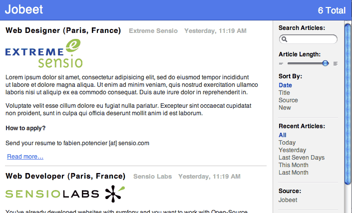

フィード
-------

求人情報を探している場合、新しいものが投稿されるとすぐに知らせが来ることが望ましいでしょう。 1時間ごとにWebサイトを確認するのはあまり便利ではないので、Jobeetのユーザーに最新情報を提供するために求人情報のフィードを追加します。

最新の Job フィード
------------------

求人のフィードを提供するために `/job/atom` という URL を扱う atom アクションを Job コントローラに作成しましょう：

    sub atom :Local {
        my ($self, $c) = @_;
        $c->res->content_type('application/atom+xml; charset=utf-8');
    }

そしてこのコントローラのためのテンプレート `job/atom.mt` を作ります：

    <?= raw_string qq[<\?xml version="1.0" encoding="utf-8"?\>] ?>
    <feed xmlns="http://www.w3.org/2005/Atom">
      <title>Jobeet</title>
      <subtitle>Latest Jobs</subtitle>
      <link href="" rel="self"/>
      <link href=""/>
      <updated></updated>
      <author><name>Jobeet</name></author>
      <id>Unique Id</id>

      <entry>
        <title>Job title</title>
        <link href="" />
        <id>Unique id</id>
        <updated></updated>
        
Job description

        <author><name>Company</name></author>
      </entry>
    </feed>

ベーステンプレートからこのフィードにリンクが張られるようにフッターのリンクを修正します：

                <li class="feed">
                  <a href="<?= $c->uri_for('/job/atom') ?>">Full feed</a>
                </li>

またブラウザがフィードを自動的に検出できるよう以下の link タグをヘッダーセクションに追加します：

        <link rel="alternate" type="application/atom+xml" title="Latest Jobs"
              href="<?= $c->uri_for('/job/atom') ?>" />

Atomテンプレートヘッダーを次のコードで置き換えます:

    ? my $w3c = $c->stash->{w3c_date};
    ? my $latest_post = $c->stash->{latest_post};
      <title>Jobeet</title>
      <subtitle>Latest Jobs</subtitle>
      <link href="<?= $c->uri_for('/job/atom') ?>" rel="self"/>
      <link href="<?= $c->uri_for('/job') ?>"/>
      <updated><?= $w3c->format_datetime($latest_post->created_at) ?></updated>
      <author><name>Jobeet</name></author>
      <id><?= sha1_hex($c->uri_for('/job/atom')) ?></id>

stash で二つの変数を受け取っています。 これらはコントローラからセットします `$w3c` は W3C 形式の DateTime フォーマッターを渡します。`$latest_post` には一番最新の Job エントリが渡されます。そのためまず Job モデルに `latest_post` メソッドを作成しましょう。

    # Jobeet::Schema::ResultSet::Job
    sub latest_post {
        my ($self) = @_;

        my $r = $self->search( { is_activated => 1, },
            { order_by => { -desc => 'created_at' } } );

        $r->first;
    }

また、テンプレート内で `sha1_hex` マクロを使用できるようにアプリケーションクラスに設定を追加しましょう。Jobeet/View/MT.pm の冒頭部に：

    use Digest::SHA1 ();

を追加し、

    has '+macro' => default => sub {
        return {
            sha1_hex => \&Digest::SHA1::sha1_hex,
        },
    };

というように macro 設定を加えると、そこで指定した関数をテンプレート内で使用することができるようになります。

コントローラでstashを埋めます：

    use DateTime::Format::W3CDTF;

    ...

    $c->stash->{w3c_date} = DateTime::Format::W3CDTF->new;
    $c->stash->{latest_post} = models('Schema::Job')->latest_post;

おっと依存モジュール `DateTime::Format::W3CDTF` をインストールするのを忘れないようにしましょう｡

フィードエントリは次のコードで生成できます：

    ? my $max_rows = Jobeet::Models->get('conf')->{max_jobs_on_homepage};
    ? for my $category ($c->stash->{categories}->all) {
    ?     for my $job ($category->get_active_jobs({ rows => $max_rows })->all) {
       <entry>
         <title><?= $job->position ?> (<?= $job->location ?>)</title>
         <link href="" />
         <id><?= sha1_hex($job->id) ?></id>
         <updated><?= $w3c->format_datetime($job->created_at) ?></updated>
         

           
<?= $job->description ?>

           <h4>How to apply?</h4>
           
<?= $job->how_to_apply ?>

         

         <author>
           <name><?= $job->company ?></name>
         </author>
       </entry>
    ?     } # endfor $job
    ? } # endfor $category

最後に atom アクションは index アクションでセットされる stash (categories) にもアクセスするため

    $c->forward('index');

と index の処理も含まれるようにします。atom アクションの全体はこのような感じになります：

    sub atom :Local {
        my ($self, $c) = @_;
        $c->res->content_type('application/atom+xml; charset=utf-8');

        $c->stash->{w3c_date} = DateTime::Format::W3CDTF->new;
        $c->stash->{latest_post} = models('Schema::Job')->latest_post;

        $c->forward('index');
    }

また明日
-------

今日の宿題はカテゴリごとのフィードです。
今日やった Job index と atom アクションのような関係を Category コントローラで作成すればOKです。

今日は、求職者のユーザーエクスペリエンスを強化しました。明日は、Webサービスを提供することで職の投稿者に優れた公開機能を提供する方法を見ることになります。
